# Index

1. [Getting Started](#GettingStarted)
    1. [Sign In](#SignIn)
2. [DashBoard Screen](#DashBoardScreen)
    1. [Top bar](#Topbar)
    2. [Navigation bar](#Navigationbar)
        1. [Home Screen](#HomeScreen)
        2. [Users Screen](#UserScreen)
        3. [Courses Screen](#CoursesScreen)
            1. [Course Info Screen](#CourseInfoScreen)
        4. [Admin Screen](#AdminScreen)
        5. [Analytics Screen](#AnalyticsScreen)
            1. [Courses Analytics](#CoursesAnalyticsScreen)
            2. [Course Analytics](#CourseAnalyticsScreen)

# <a name="GettingStarted">Getting Started</a>

## <a name="SignIn">Sign In</a>

This is the first page that you will see if this is your first time using the app. In case you don't have an account it means that you are not an administrator so you do not have permissions to enter this web.

If you do have an account you can Sign In by putting your email and password.

   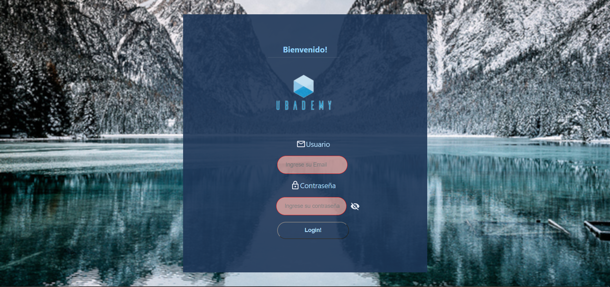

# <a name="DashBoardScreen">DashBoard Screen</a>

## <a name="Topbar">Top bar</a>

The top bar is available on top of the screen. It allows you to see notifications or Log Out from your account using the settings button.

   

## <a name="Navigationbar">Navigation bar</a>

The navigation bar is available on the side of the screen. It allows you to navigate and see the resources and work from every icon.

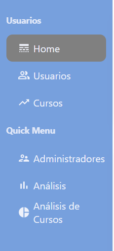

## <a name="HomeScreen">Home Screen</a>

This is the home screen. From here you can see some User Metrics.

1. Pie Charts: Blocked users and users using mail-login service or google-login service from total of users
2. Admin Users: Admin users and status
3. Users: Public users and status

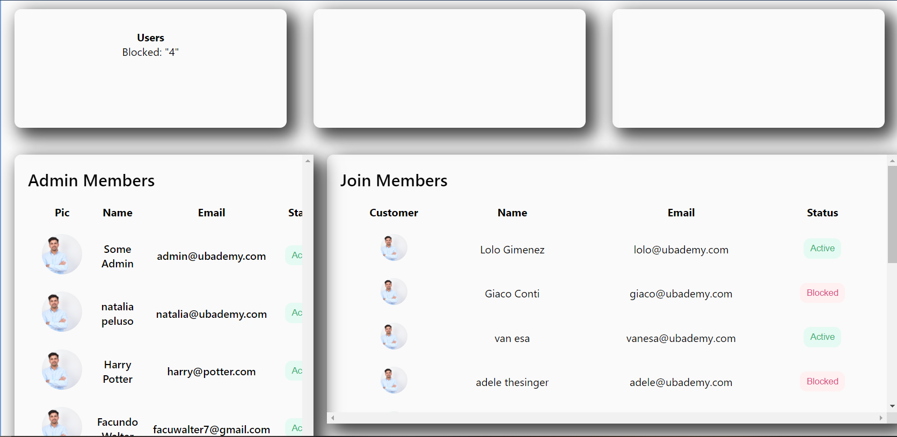

## <a name="UserScreen">Users Screen</a>

This is the users screen, this is a list with the info of all the users in your database. From here you can edit all users info by going to **Edit**, block/unblock by going to the **Block** button and you can see the profile of a particular user by clicking on the **Eye** button.

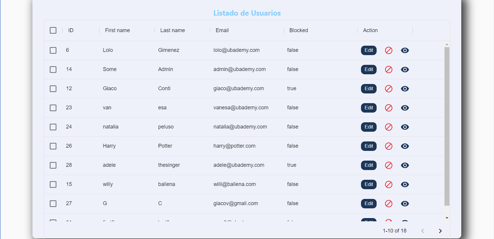

## <a name="EditUserScreen">Edit user Screen</a>

Here you can change info of a particular user, just type the new information and press **GUARDAR**.

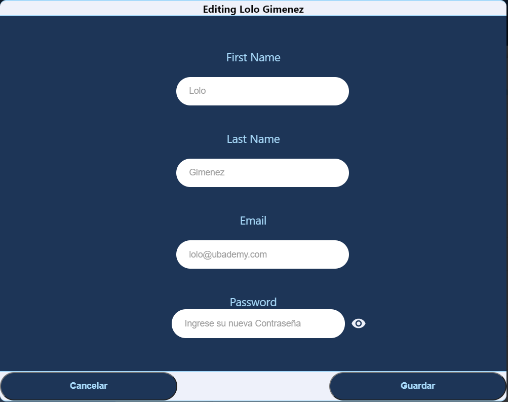

## <a name="CoursesScreen">Courses Screen</a>

## All Courses

Here you will have a list of all courses that every user created, you can access any of the courses by touching the **Eye** button
or block/unblock a course by pressing the **Block** button.

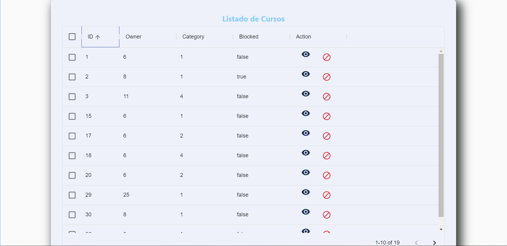

# <a name="CourseInfoScreen">Course Info Screen</a>

Once you've press the **Eye** button you can visualize properties of a particular course that you selected. You can see some the name of the course, category and some others. Also if you press on **inscriptions** a modal will pop up and show you info of the subscribed users. You can close the modal by scrolling down and clicking on the **Salir** button.

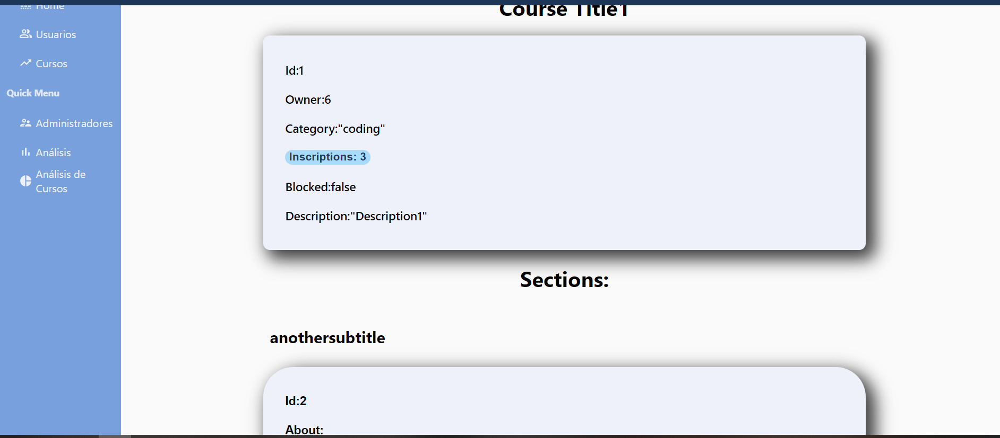

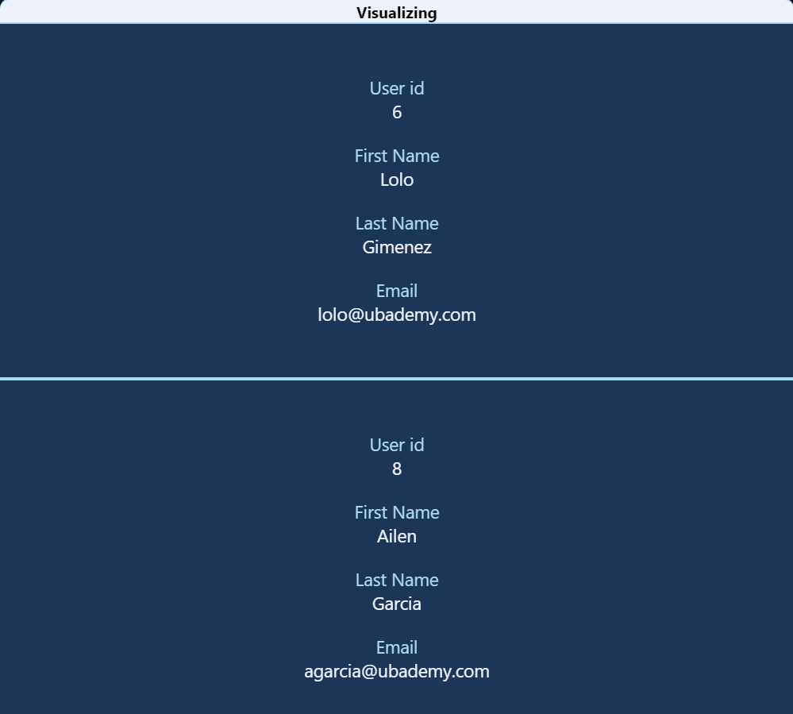

Also you can visualize **Sections** of that same course. By pressing on one of the sections, it will redirect you to another page to see all the content of that particular section.

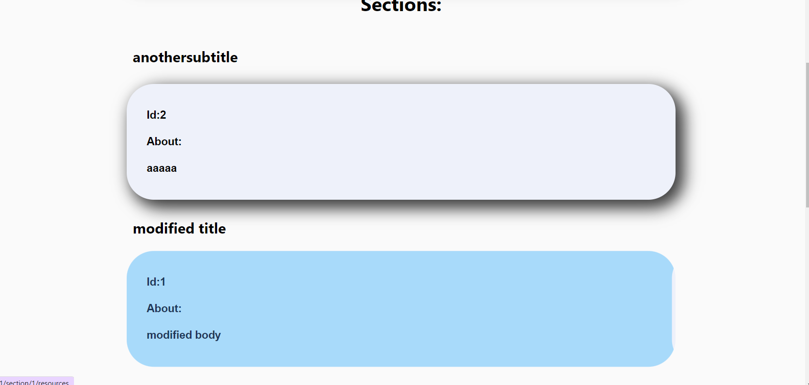

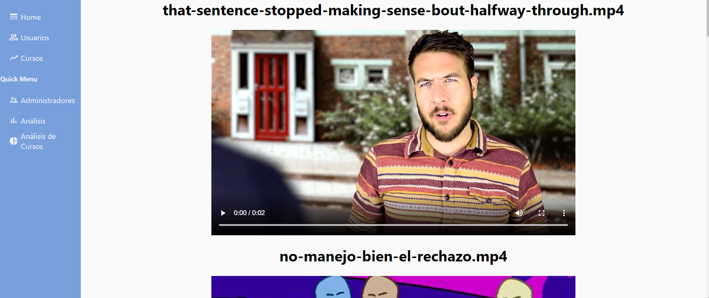

## <a name="AdminScreen">Admin Screen</a>

This screen is where you as an **Admin** can create another **Admin**. Just complete the fields required with valid info and voilà, you just created an **Admin**

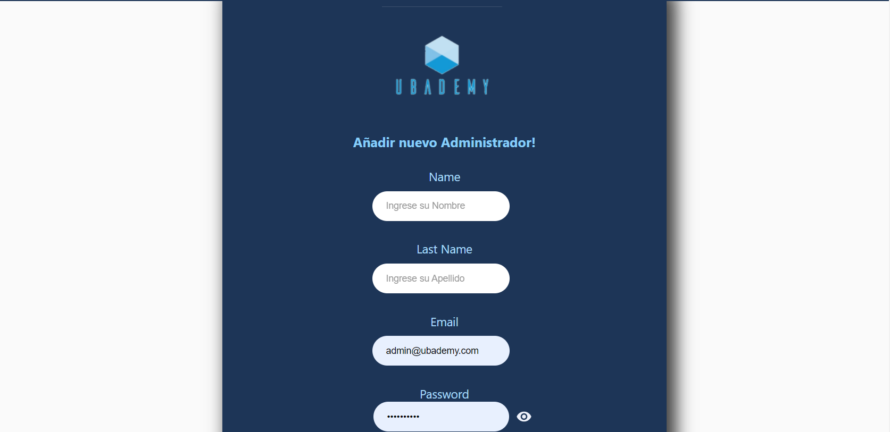

## <a name="AnalyticsScreen">Analytics Screen</a>

# <a name="CoursesAnalyticsScreen">Courses Analytics Screen</a>

# <a name="CourseAnalyticsScreen">Course Analytics Screen</a>